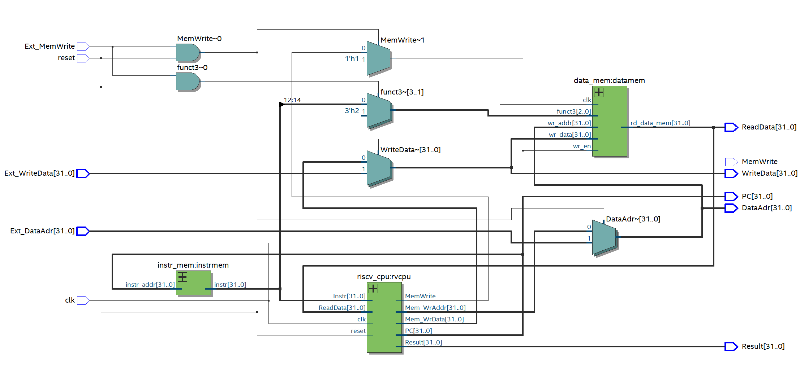
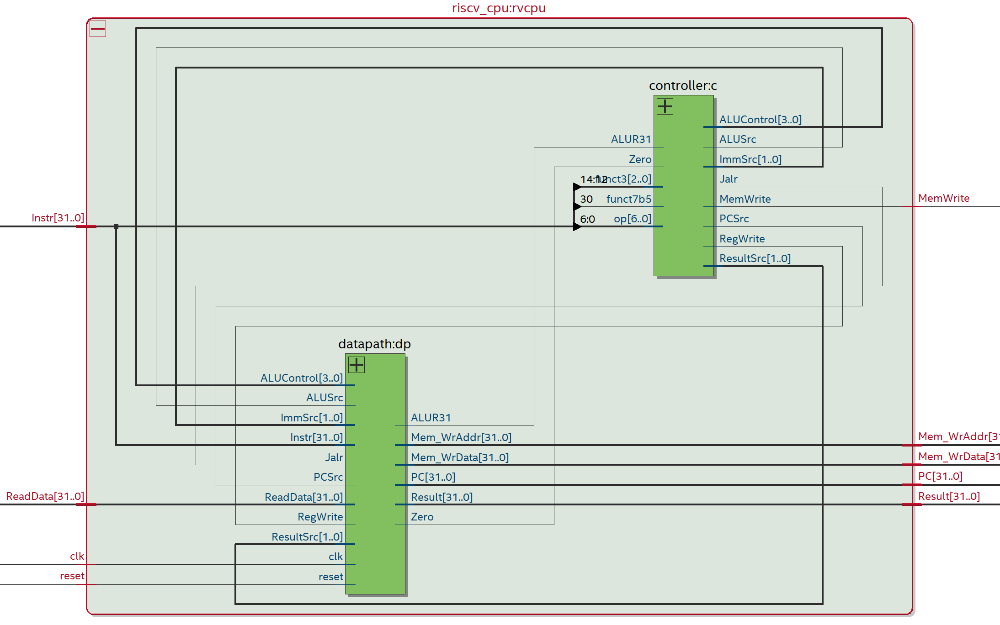
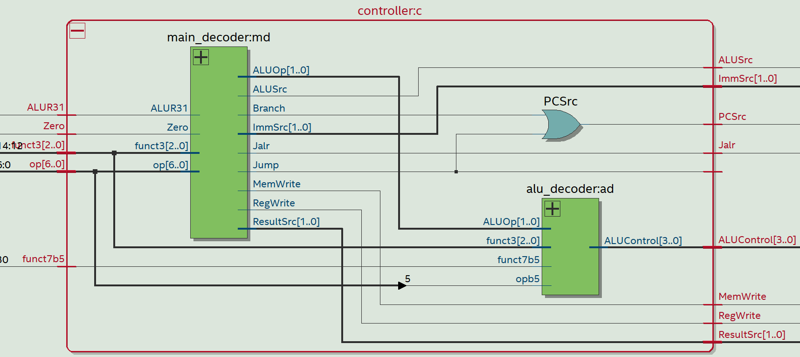
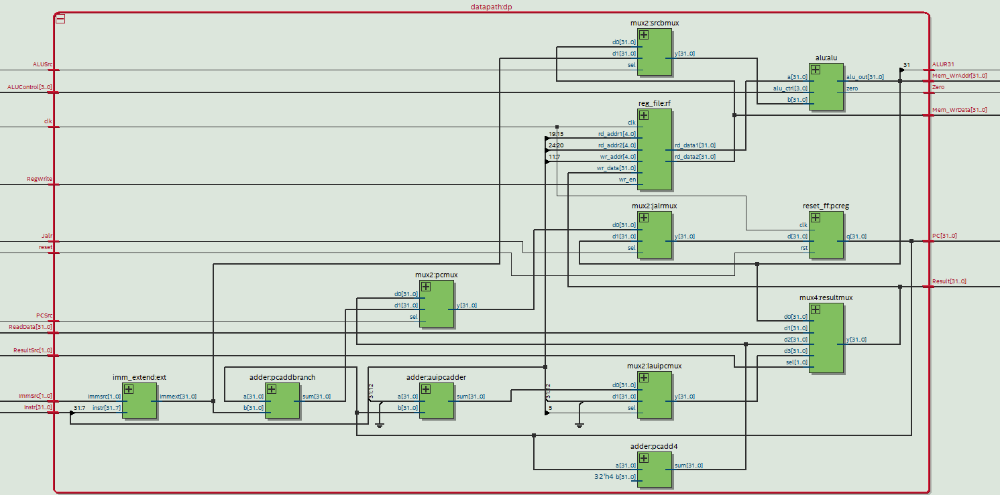
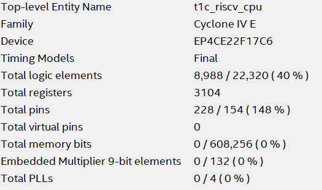

# Single-Cycle RISC-V CPU

A Verilog-based implementation of a **Single-Cycle RISC-V CPU** supporting the **RV32I ISA**. This design executes all instructions in one clock cycle and is ideal for learning, simulation, and FPGA prototyping.

---

## ✅ **Overview**

This project demonstrates the design of a single-cycle CPU using the RISC-V ISA (RV32I). It includes:

* **RISCV CPU**
* **Controller**
* **Datapath**
* **Instruction Memory**
* **Data Memory**
* **Main Decoder**
* **ALU Decoder**
* **Register File**
* **ALU**
* **Immediate Extenders**
* **Program Counter**
* **Supporting Components** (Mux, Adders, etc.)
* **Testbench for Simulation**

---

## 📂 **Project Structure**

```
├── t1c_riscv_cpu.v      # Top-level CPU module
├── riscv_cpu.v          # Sub level housing the controller and datapath
├── controller.v         # Decodes the op code instructions
├── datapath.v           # Processes the instructions
├── instr_mem.v          # Instruction Memory
├── data_mem.v           # Data Memory
├── tb.v                 # Testbench for CPU verification
├── components/          # Submodules (MUX, ALU, Register File, Adders)
├── program.hex          # Machine code for execution
├── rv32i_test.hex       # Test program in hex format
├── rv32i_book.hex       # Additional RISC-V program
├── rv32i_test.s         # RISC-V assembly for functional testing
├── program.lss          # Disassembled program listing
```

---

## 🖼 **Architecture**



---

## ⚙️ **Key Components**

* **riscv\_cpu.v :**
 Main CPU module connecting all components.



* **controller.v :**
 Decodes instruction opcodes and generates control signals to drive ALU, memory, and register operations.



* **datapath.v :**
 Processes the intructions and acts upon jump, branch, alu, imm_ext instructions.



* **components/**
  Includes:

  * **MUX**: Handles data path selection.
  * **Adders**: For PC and address calculations.
  * **Register File**: 32 registers for instruction execution.
  * **ALU**: Performs arithmetic and logical operations.

---

## 📸 **Stats for Nerds**

<p align="center">
  
</p>

---

## 🧪 **Testbench**

* **tb.v**
  Simulates the CPU with a given instruction memory. Verifies correctness for:

  * Arithmetic and logical operations
  * Memory load/store
  * Branch and jump instructions
* Uses programs from:

  * **rv32i\_test.hex**
  * **program.hex**

---

## 🛠 **How to Run**

1. Compile using **ModelSim/Questa/iverilog**:

   ```bash
   iverilog -o cpu_tb tb.v riscv_cpu.v data_mem.v instr_mem.v components/*.v
   vvp cpu_tb
   ```
2. Load waveform in **GTKWave**:

   ```bash
   gtkwave dump.vcd
   ```

---

## ✅ **Features**

* Implements **RV32I instruction set**
* Single-cycle execution
* Modular design for easy understanding
* Ready for FPGA deployment

---

## 🔍 **Example Test Program**

The file **rv32i\_test.s** tests all RV32I instructions:

* **Arithmetic & Logical**: ADD, SUB, AND, OR, XOR, etc.
* **Immediate**: ADDI, ORI, ANDI, etc.
* **Load/Store**: LW, SW, LB, SB
* **Branch**: BEQ, BNE, BLT, BGE, etc.
* **Jump**: JAL, JALR
* **Upper Immediate**: LUI, AUIPC

---

## 🚀 **Future Enhancements**

* Implement **Pipelining**
* Add **Hazard Detection & Forwarding**
* Implement **CSR instructions**
* Optimize for FPGA

---

### **License**

[GNU General Public License v3.0](LICENSE)
